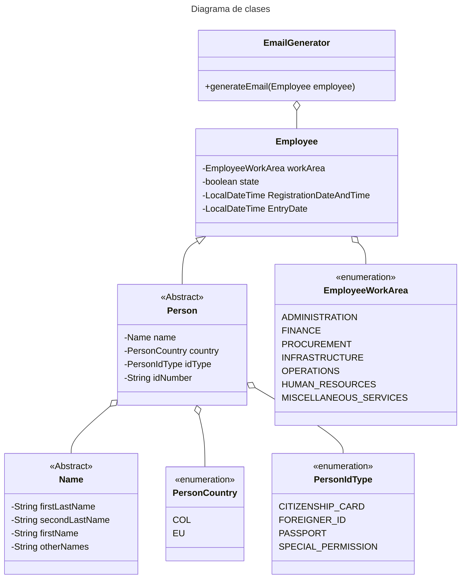

> Puede renderizar los diagramas UML utilizando [Mermaid](https://mermaidjs.github.io/).

```mermaid
---
title: Diagrama de clases
---
classDiagram
    EmailGenerator  o-- Employee
    Person o-- Name
    Person o-- PersonCountry
    Person o-- PersonIdType
    Employee <|-- Person
    Employee o-- EmployeeWorkArea

    class Person{
     <<Abstract>>
        -Name name
        -PersonCountry country
        -PersonIdType idType
        -String idNumber
    }
    class Name{
     <<Abstract>>
        -String firstLastName
        -String secondLastName
        -String firstName
        -String otherNames
    }
    class PersonCountry{
        <<enumeration>>
        COL
        EU
    }
    class PersonIdType{
        <<enumeration>>
        CITIZENSHIP_CARD
        FOREIGNER_ID
        PASSPORT
        SPECIAL_PERMISSION
    }
    class Employee{
        -EmployeeWorkArea workArea
        -boolean state
        -LocalDateTime RegistrationDateAndTime
        -LocalDateTime EntryDate
    }
     class EmployeeWorkArea{
        <<enumeration>>
        ADMINISTRATION
        FINANCE
        PROCUREMENT
        INFRASTRUCTURE
        OPERATIONS
        HUMAN_RESOURCES
        MISCELLANEOUS_SERVICES
    }
    class EmailGenerator{
        +generateEmail(Employee employee)
    }
    end
```